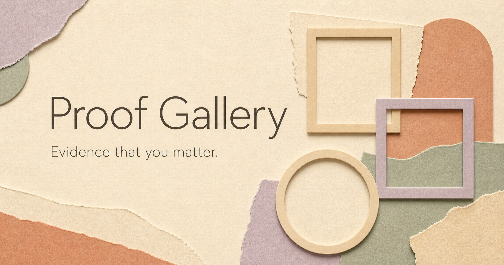

# Proof Gallery

### Mac Photos companion (local development build)

The optional [Mac companion](docs/COMPANION.md) requests Photos permission only
when you connect, then reads Recent Photos, Favorites, or a chosen album/date
range while open. Recent Photos needs no Favorites: default last 90 days,
newest 50 maximum. Optional on-device text recognition and Photos metadata help
you review/filter the batch; they never decide what matters or become quotes.
OCR excerpts stay in native memory and are not included in the export.
It prepares still photos locally, preserves source/date receipts, and exports
a private review file. In the web gallery choose **Photos & media → Import
companion review**. Candidates still need a category and explicit approval.

This is a file handoff, not automatic sync. No iCloud download or cloud AI runs.
The local app is ad-hoc signed for development; public Mac distribution still
needs Developer ID signing and notarization. Native Android/Windows companions
are not included; their selected-media web picker remains available.

**A free, local-first place for real evidence of being loved, valued, connected, and accomplished.**



Try the browser-local edition at [proof-gallery-9jn.pages.dev](https://proof-gallery-9jn.pages.dev/).

Proof Gallery is for moments when depression or a difficult week makes positive
autobiographical evidence hard to access. Save the actual message, receipt,
photo, finished work, award, recovery moment, or memory with its date and
source. Later, search only that collection. This is not merely a record of tasks
or financial receipts: care, belonging, being chosen, parenting, creativity, and
recovery are central. It never scores whether a person is good or worthy.

> Proof does not cancel pain or demand optimism. It restores concrete evidence
> you chose to save.

## What it is

- An explicit, no-account local mode backed by this browser profile's IndexedDB.
- An optional hosted Supabase mode with owner accounts and row-level security.
- Photos and screenshots in either mode; short MP4/WebM clips in local mode.
- A browser-local media review inbox: choose a batch or a supported folder,
  inspect original media, add a short note, and explicitly save selected items.
  Pending items are physically separate from saved Proof and never searched.
- Note-first review with optional, visible word-based category/tag suggestions,
  connections to saved Proof, and an exact-note story reading view.
- Exact evidence, occurred date, source type/detail, category, tags, person, and
  project.
- Category/tag filters, newest ordering, and relevance ordering during search.
- Visible result counts, separate search/filter resets, and a show-all action
  when filters or search hide the saved collection.
- Deterministic Proof-only lexical search that works locally without a model,
  provider, or paid API key.
- Optional semantic embeddings for Supabase mode through one OpenAI-compatible
  endpoint.
- No app analytics or session replay, advertising, social feed, collection
  without a selected source, or ChorOS subscription.
- An image-forward public design whose bundled stock/AI visuals are visibly
  labeled decoration and are never used as item imagery or evidence.

## What it is not

This is not a gratitude journal, mood diagnosis, worth score, public profile, or
argument that suffering is not real. The web gallery does not mine email,
photo libraries, messages, finances, memories, or accounts. The optional Mac
companion reads only its owner-selected Photos scope while active. Neither
automatically saves candidates as Proof or surfaces evidence during distress.

The repository is public. Evidence is not: local-mode evidence remains in the
chosen browser profile, and hosted-mode evidence remains in the Supabase
instance the operator controls. This repository contains synthetic test text
only — no personal entries, production data, screenshots, or credentials.

## Quick start

The fastest route needs only [Bun](https://bun.sh):

```bash
git clone https://github.com/Muse-Nexus/proof-gallery.git
cd proof-gallery
bun install
bun run dev
```

Open `http://localhost:5173`, choose **Start in this browser**, and add an item. That
choice is explicit: an unavailable or misconfigured Supabase connection never
silently falls back to local storage.

Local mode needs no account and makes no evidence or search request to
Supabase, an embedding service, Drive, or Dropbox. Items and image bytes stay in
IndexedDB for that browser profile. Local mode is not account-authenticated,
not encrypted by Proof Gallery, and not automatically synchronized. Back up
regularly with the user-initiated versioned JSON export; the resulting plaintext
file can be kept in a private local folder or placed in a private Google Drive
or Dropbox folder by the user. Integrity receipts detect backup corruption but
do not authenticate or encrypt the file.

For authenticated, multi-device storage, use the optional Supabase mode. It
requires the [Supabase CLI](https://supabase.com/docs/guides/local-development)
and Docker for local development, or a dedicated hosted Supabase project. The
fail-closed migration rejects pre-existing Storage object policies that could
broaden access.

See [Self-hosting](docs/SELF_HOSTING.md) for both modes, deployment origins,
optional embeddings, backups, and account deletion.

## Search modes

Local mode uses deterministic lexical ranking over Proof items in the selected
browser profile. It does not call a model or provider. Local and Supabase
collections are separate: Proof Gallery does not silently sync, migrate,
co-search, or merge them.

In Supabase mode, Postgres full-text and trigram ranking operate only on
`proof_items`, with owner RLS applied before ranking.

Semantic retrieval is optional. Configure one OpenAI-compatible embedding
endpoint in Edge Function secrets:

```bash
supabase secrets set \
  OPENAI_API_KEY=your-server-side-key \
  EMBEDDING_MODEL=text-embedding-3-small \
  EMBEDDING_DIMENSIONS=1536
```

For a fully local route, point `EMBEDDING_BASE_URL` at an OpenAI-compatible
local server such as Ollama and choose its model. The provider and dimension are
stored with each vector so unlike embeddings are never compared. Search falls
back visibly to lexical results if embeddings are missing, rate-limited, or
unavailable.

Proof text and search text leave your Supabase instance only when you configure
an external embedding endpoint. Images are never sent for vision analysis.

## Visual truth boundary

The interface uses medium-weight system typography with no external font
request. Filtered-empty states do not claim that saved evidence is missing,
and the editor stays open while a save is pending to prevent accidental
dismissal through Escape, the backdrop, or its close controls.
Add, Edit, and Delete wait for other pending operations to finish, so an
unrelated search or backup cannot open an editor with locked save controls.

The landing page bundles one credited Unsplash paper collage and one original
AI-generated cut-paper illustration. They load from this app's own origin and
make no automatic asset or API request to either provider. The credited
Unsplash links navigate there only when a user chooses them. Both visuals are
labeled **Not saved Proof** and exist only in public-page presentation.

Inside the gallery, there are no stock or AI fallbacks. A card displays an image
only when a stored evidence attachment has an available preview. If a saved
attachment cannot be previewed, the card says so without claiming it is
missing; only an item with no stored attachment is labeled **Text-only Proof ·
No image attached**. Exact visual asset receipts and the AI prompt are in
[docs/VISUAL_ASSETS.md](docs/VISUAL_ASSETS.md).

## Privacy architecture

- Local mode stores items and image bytes in IndexedDB for the current origin
  and browser profile. It has no owner authentication and is not encrypted by
  Proof Gallery; other users of that profile, privileged extensions, device
  administrators, and JavaScript executing on the same origin may be able to
  read it.
- Clearing site data, browser eviction, private-browsing teardown, or profile
  loss can erase local data. Export files are portable plaintext and must be
  protected by the user.
- A dedicated hostname is required for meaningful browser-storage isolation.
  GitHub Pages project paths share their parent origin and therefore share its
  browser-storage trust boundary.
- `proof_items.visibility` is fixed to `personal`.
- Postgres uses `ENABLE ROW LEVEL SECURITY` plus `FORCE ROW LEVEL SECURITY`.
- Separate owner-only policies cover SELECT, INSERT, UPDATE, and DELETE.
- Table grants are reset before authenticated CRUD is granted; `TRUNCATE`,
  `TRIGGER`, and `REFERENCES` are not granted.
- Images use signed URLs from a private `proof-images` bucket with owner-folder
  policies, a 10 MB limit, safe raster MIME allowlist, and browser magic-byte
  validation.
- Search and indexing authenticate the JWT and use the caller's RLS-scoped
  Supabase client. There is no service-role fallback for evidence reads.
- Optional embedding requests have a distributed 20-per-minute owner budget.
- No analytics, session replay, public media URLs, or request-body logging.

Read the full [privacy and threat model](docs/PRIVACY.md) and
[safety constitution](docs/SAFETY.md).

## Development

```bash
bun run typecheck
bun run test
bun run build
deno check supabase/functions/proof-search/index.ts
deno check supabase/functions/embed-proof/index.ts
```

Database integration tests require Docker and a local Supabase stack at
`127.0.0.1:54321`. They fail closed for any non-local URL because they create
and delete synthetic fixture users:

```bash
proof_env_file="$(mktemp -t proof-gallery.XXXXXX)"
trap 'rm -f "$proof_env_file"' EXIT
supabase status -o env > "$proof_env_file"
set -a && source "$proof_env_file" && set +a
psql "$DB_URL" -f tests/integration/grants.sql
bun run test:integration:local
```

The temporary file contains a local service-role credential and is removed on
shell exit. All tests and examples must stay explicitly synthetic.

## Photos and media

Open **Photos & media** in local mode. A standard file picker accepts selected
files from Mac, Android, or PC; a folder picker is also shown where supported.
It is a one-time selection, not a photo-library grant or continuous folder watch.
No companion installation or external account is required for this path.

- JPEG, PNG, WebP, GIF, MP4, and WebM; 10 MB per file.
- Up to 50 files / 48 MiB per batch; inbox limited to 100 files / 48 MiB.
- Duplicate file bytes are skipped across pending and saved attachments.
- The original file is retained, including embedded metadata. No vision model,
  face recognition, person identification, OCR, or AI interpretation runs.
- Filename is the initial title/source; occurred date and category are not
  guessed. File modification time is not an event date.
- Reviewers must choose or accept a suggested category, individually or for a
  selected batch. Notes may be empty when an attachment is present. Tags can be
  added in bulk.
- Details must be saved or discarded before bulk approval. Approval checks
  media integrity and atomically moves the selected items to saved Proof.
- Pending items survive reload but **are excluded from backups and search**.
  Remove them from review separately; the original files are untouched.
- For the web file picker, export Apple Photos selections as JPEG first;
  direct HEIC/HEIF and MOV imports are not supported. The optional Mac companion
  can instead prepare labelled JPEG previews from local HEIC/HEIF originals.
  MP4/WebM codec playback depends on the browser. Original-file download
  remains available even when preview fails.
- This is cross-platform file access, **not cross-device sync**. Each browser
  profile has its own collection. Use private backups for manual transfer.

Local backup version 2 supports attachment-only Proof and clips. Version 1
image/text backups still import. Archives retain the historical `image` field
name for media and are capped at 64 MiB encoded / 48 MiB decoded media. Pending
media is not included; keep original files until approved Proof is backed up.
The hosted Supabase mode remains raster-only with its existing validation,
required evidence text, RLS, and private bucket. No database migration is needed.

## A photo, a short note, and a story

In **Photos & media**, each pending image has a visible **Your short note** field.
Write a few words and choose **Save note**; title, date, source, and other fields
live under **Extra details · optional**. This saves a review draft, not approved
Proof. A category is required only when approving it into the gallery.

The app suggests a category from a small set of visible word cues, adds up to
six literal-word tags, and can replace an untouched filename title with the
beginning of your note. Suggestions are shown before saving and can be switched
off. Fields you change manually are respected, including removed tags and an
explicitly cleared category. Later note edits default to suggestions off.
Ambiguous or negated cues leave the category unresolved. A mention of crying
does not infer recovery, happiness, or why it happened. Dates, names, identity,
sources, and emotional meaning are never guessed.

**Find related saved Proof** checks meaningful shared words in the current note,
tags, person, and project against already-loaded saved Proof in the same
collection. It explains the shared words and displays the original notes, dates,
and sources. This is lexical matching, not semantic or AI interpretation. Pending
photos and ordinary ChorOS memories are not searched; an unsaved note is clearly
labelled as a draft. Nothing is sent to a model or provider.

On a saved card, **Read as a story** opens a quiet, image-forward reading view.
You can choose up to six related saved moments to join it. The sequence keeps
your exact notes and source labels, ordering known occurred dates first and
marking unknown dates separately. It does not generate narrative prose, invent
transitions, or save a new evidence item. Removing an item from saved Proof also
removes it from the reading view. A generated story writer is not included.

## Scope and direction

The product direction is permissioned discovery that reduces the owner's
collection work, while preserving literal evidence and a private review
boundary. The implemented slice is selected-media intake, review, CRUD,
filtering, scoped retrieval, and local backup/restore. A local-development Mac
companion adds bounded Photos access while open and a manual review-file
handoff. Closed-app collection, cloud connectors, native Android/Windows
companions, and an automatic ChorOS transfer bridge are not implemented.
Existing ChorOS grants do not transfer to this app. Public sharing of evidence,
mood diagnosis, worth scoring, invented emotional meaning, and mandatory model
orchestration are not part of the product.

## Contributing and security

Read [CONTRIBUTING.md](CONTRIBUTING.md). Never paste personal evidence,
credentials, signed URLs, or production identifiers into an issue, test,
screenshot, discussion, or pull request.

Report security or privacy problems privately using the repository's Security
tab as described in [SECURITY.md](SECURITY.md).

## License

[MIT](LICENSE). The software is free. Hosting and optional third-party embedding
providers may have their own costs. See [NOTICE.md](NOTICE.md) for origin and
bundled dependency notices.
